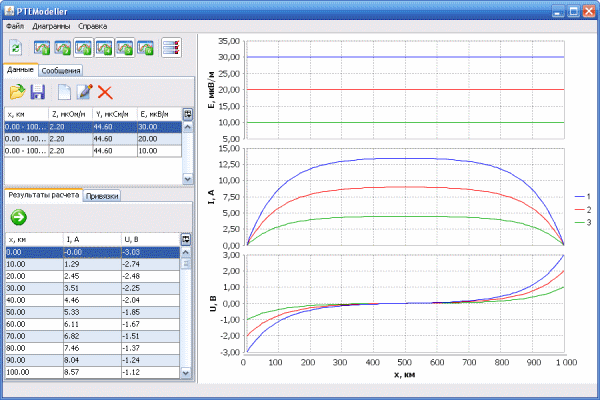

**PTEModeller**

Pipeline Telluric Effect Modeller

Modelling of geomagnetically induced current generation in underground pipelines. Calculation of the dependence of the current strength in the pipeline and the potential difference between the pipeline and the ground from the linear coordinate.

